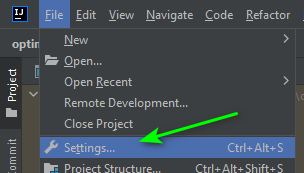
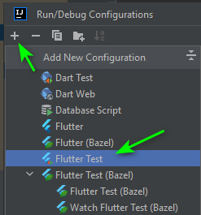

# Optimizely Flutter SDK IntelliJ Setup

### Development

1. [Install Dart](https://dart.dev/get-dart#install) for your platform.
2. Configure your IDE to point to the Dart SDK directory listed from the installation instructions.   e.g. Windows: C:\tools\dart-sdk
3. [Install Flutter](https://docs.flutter.dev/get-started/install) for your platform.
*Note*: The download is big. Extract using an archive tool if needed. 
4. Ensure your PATH includes the `bin` directory of your Flutter installation.   e.g. Windows: `C:\src\flutter\binC:\src\flutter\bin`
5. In IntelliJ, install the following plugins:
   1. Dart by JetBrains 
   2. Flutter by flutter.dev
6. In your IDE and in the path of this repo, open a terminal and run  `flutter packages get`
7. In IntelliJ, configure Flutter settings
   1. Go to File > Settings...  
      
   2. Configure the Flutter SDK and additional settings  
      

## Testing In IntelliJ

1. Click Edit Configurations... in the Run/Debug configurations menu  
   
2. Click the + button and add a Flutter Test configuration  
   
3. Configure the settings for the test run  
   
4. Run the test suite to ensure correct settings  
   